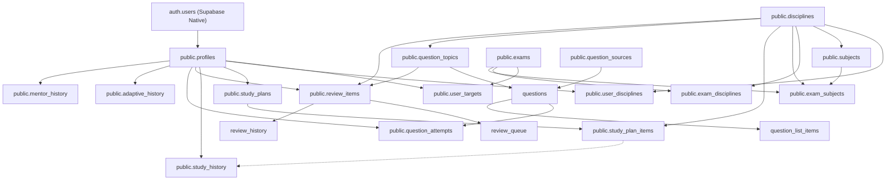

# 🗄️ Plano Mestre de Migração do Banco de Dados — Supabase Definitivo

> **Documento Oficial de Arquitetura de Banco de Dados**  
> **Status:** Planejamento e Auditoria Completa  
> **Objetivo:** Estabelecer o plano de reconstrução e ordenação estrita do banco de dados PostgreSQL no Supabase Cloud/Local do zero, garantindo integridade referencial, segurança RLS e zero erros de execução.

---

## 📌 1. Análise de Incompatibilidades, Duplicidades e Substituições

Antes da execução de qualquer script, a auditoria das migrations existentes na pasta `docs/` identificou as seguintes particularidades:

| Script Original | Status na Migração Mestre | Observação / Ação Necessária |
|:---|:---:|:---|
| `sprint3-database.sql` | 🟡 Parcialmente Substituído | Cria `profiles`, `user_targets`, `disciplines`, `user_disciplines` e `study_sessions`. A tabela `study_sessions` foi posteriormente estendida/substituída pela `study_history` no `sprint3-history.sql`. |
| `sprint3-history.sql` | ✅ Ativo | Cria a tabela `study_history` (histórico rico de tempo líquido, foco, energia e dificuldade). |
| `sprint5-database.sql` | ✅ Ativo | Cria `exams`, `subjects`, `exam_subjects` e insere seeds iniciais. |
| `sprint5-questions.sql` | ✅ Ativo | Cria `question_sources`, `question_topics`, `questions`, `question_attempts`, `question_lists`, `question_list_items`. |
| `sprint5.5-database-update.sql` | 🟡 Incorporado | Atualização pontual do `user_disciplines`. Pode ser mesclado diretamente na criação da tabela. |
| `sprint6-database.sql` | ✅ Ativo | Cria `exam_disciplines`, altera `user_disciplines` (adiciona `mastery_level` e amplia enums de status) e popula seeds da PF e PRF. |
| `sprint6-reviews.sql` | ✅ Ativo | Cria `review_strategies`, `review_items`, `review_queue`, `review_history`, `review_statistics`. |
| `sprint7-database.sql` | ✅ Ativo | Cria `study_plans` e `study_plan_items`. |
| `sprint7-adaptive.sql` | ✅ Ativo | Cria `adaptive_history` (log de decisões do motor adaptativo). |
| `sprint8-mentor.sql` | ✅ Ativo | Cria `mentor_history` (histórico de análises e telemetria do Mentor IA). |

### ⚠️ Riscos de Duplicidade e Idempotência
1. **`disciplines` sem `UNIQUE(name)`:** O comando `INSERT INTO disciplines (name, area)` sem constraint `UNIQUE` em `name` pode gerar registros duplicados se executado múltiplas vezes. É recomendável criar a constraint `UNIQUE(name)` na criação da tabela.
2. **Constraint de `status` em `user_disciplines`:** O script `sprint3-database.sql` cria a tabela com a constraint `status IN ('STUDYING', 'COMPLETED', 'REVISING')`. Já a Sprint 6 altera para `('NOT_STARTED', 'STUDYING', 'REVISING', 'COMPLETED', 'READY_FOR_SCHEDULE')`. A tabela deve ser criada diretamente com os valores expandidos.

---

## 🔗 2. Grafo de Dependências entre Tabelas



---

## 📜 3. Ordem de Execução Estrita (Etapa por Etapa)

Para garantir a criação sem erros de Chave Estrangeira (FK), os scripts devem ser executados estritamente nesta ordem:

### ETAPA 1: Estrutura Core e Autenticação
1. **`public.profiles`**: Tabela de perfis ligada ao `auth.users`.
2. **Function & Trigger `handle_new_user()`**: Criação automática de perfil ao registrar usuário no `auth.users`.

### ETAPA 2: Domínio Mestre de Concursos e Disciplinas
3. **`public.exams`**: Tabela mestre de concursos (ex: PF, PRF).
4. **`public.disciplines`**: Tabela mestre de disciplinas globais (`UNIQUE(name)`).
5. **`public.subjects`**: Tabela de assuntos vinculada a `disciplines`.
6. **`public.exam_disciplines`**: Tabela associativa entre `exams` e `disciplines` (pesos e ordem).
7. **`public.exam_subjects`**: Edital verticalizado detalhado (`exams`, `disciplines`, `subjects`).

### ETAPA 3: Vínculos e Progresso do Usuário
8. **`public.user_targets`**: Concurso-alvo ativo do usuário (FK `profiles`, `exams`).
9. **`public.user_disciplines`**: Status e domínio do aluno por disciplina (FK `profiles`, `disciplines`).

### ETAPA 4: Planejamento e Histórico de Estudos
10. **`public.study_plans`**: Planos e ciclos de estudo gerados (FK `profiles`).
11. **`public.study_plan_items`**: Itens/blocos do ciclo (FK `study_plans`, `disciplines`).
12. **`public.study_history`**: Registro detalhado de sessões de estudo (FK `profiles`, `disciplines`, `study_plan_items`).

### ETAPA 5: Banco de Questões
13. **`public.question_sources`**: Mestre de fontes de questões (ex: TEC, QConcursos).
14. **`public.question_topics`**: Árvore hierárquica de tópicos de questões (FK `disciplines`, auto-referencial `parent_topic_id`).
15. **`public.questions`**: Base mestre de questões (FK `question_sources`, `disciplines`, `question_topics`).
16. **`public.question_attempts`**: Tentativas e respostas do aluno (FK `profiles`, `questions`).
17. **`public.question_lists` & `question_list_items`**: Cadernos customizados de questões (FK `profiles`, `questions`).

### ETAPA 6: Motor de Revisões Espaçadas (Anki Engine)
18. **`public.review_strategies`**: Estratégias FSRS e SM-2+.
19. **`public.review_items`**: Flashcards/itens universais de revisão (FK `profiles`, `disciplines`, `question_topics`).
20. **`public.review_queue`**: Fila diária de pendências (FK `profiles`, `review_items`).
21. **`public.review_history`**: Log de revisões executadas (FK `profiles`, `review_items`, `review_strategies`).
22. **`public.review_statistics`**: Cache de estatísticas de retenção (FK `profiles`).

### ETAPA 7: Aprendizado Adaptativo e Mentor IA
23. **`public.adaptive_history`**: Log de auditoria das decisões do motor adaptativo (FK `profiles`, `disciplines`, `question_topics`).
24. **`public.mentor_history`**: Telemetria e logs das sessões do Mentor IA (FK `profiles`).

---

## ⚡ 4. Triggers, Functions e Security Policies (RLS)

### Triggers & Functions
- **`public.handle_new_user()`**: Trigger na tabela `auth.users` que cria um registro em `public.profiles` automaticamente.
  ```sql
  CREATE OR REPLACE FUNCTION public.handle_new_user()
  RETURNS TRIGGER AS $$
  BEGIN
    INSERT INTO public.profiles (id, email, name)
    VALUES (new.id, new.email, new.raw_user_meta_data->>'name')
    ON CONFLICT (id) DO NOTHING;
    RETURN new;
  END;
  $$ LANGUAGE plpgsql SECURITY DEFINER;

  CREATE TRIGGER on_auth_user_created
    AFTER INSERT ON auth.users
    FOR EACH ROW EXECUTE PROCEDURE public.handle_new_user();
  ```

### Isolamento RLS (Row Level Security)
Todas as tabelas de dados do usuário DEVEM possuir RLS ativo com a regra base de isolamento por `user_id`:
- `auth.uid() = id` (para `profiles`)
- `auth.uid() = user_id` (para `user_targets`, `user_disciplines`, `study_plans`, `study_history`, `question_attempts`, `review_items`, `review_queue`, `review_history`, `adaptive_history`, `mentor_history`).
- Tabelas públicas/mestres (`exams`, `disciplines`, `subjects`, `exam_disciplines`, `exam_subjects`, `question_sources`, `question_topics`, `questions`, `review_strategies`) recebem leitura liberada para `auth.role() = 'authenticated'` ou `true`.

---

## 🌱 5. Seeds Essenciais Iniciais

Na migração inicial, os seguintes dados mestres DEVEM ser inseridos:

1. **Disciplinas Globais (`public.disciplines`):**
   - Língua Portuguesa, Informática, Raciocínio Lógico, Estatística, Direito Constitucional, Direito Administrativo, Direito Penal, Direito Processual Penal, Legislação Especial, Ética no Serviço Público, Física, Legislação de Trânsito.
2. **Concursos Padrão (`public.exams`):**
   - Polícia Federal - Agente
   - Polícia Rodoviária Federal
3. **Edital Base (`public.exam_disciplines` e `public.exam_subjects`):**
   - Mapeamento das disciplinas e assuntos para os concursos da PF e PRF com pesos de 1.0 a 2.0.
4. **Estratégias de Revisão (`public.review_strategies`):**
   - `SM2_PLUS` (SuperMemo 2 estendido)
   - `FSRS` (Free Spaced Repetition Scheduler)

---

## 🗄️ 6. Storage Buckets (Arquivos Externos)

Se o projeto necessitar de armazenamento de arquivos (avatares, logos de bancas, anexos de questões):
- **`avatars`**: Bucket público para fotos de perfil dos alunos.
- **`question-media`**: Bucket público para imagens de enunciados de questões.

---

## 📋 7. Checklist Mestre de Migração do Banco

Use este checklist ao rodar os scripts de banco no ambiente Supabase definitivo:

- [ ] **Fase 1: Configuração Inicial**
  - [ ] Criar novo projeto no Supabase Cloud.
  - [ ] Obter nova `NEXT_PUBLIC_SUPABASE_URL` e `NEXT_PUBLIC_SUPABASE_ANON_KEY`.
  - [ ] Atualizar `.env.local` com as novas chaves.

- [ ] **Fase 2: Execução das Tabelas Base**
  - [ ] Executar Etapa 1: `profiles` e Trigger `handle_new_user`.
  - [ ] Executar Etapa 2: `exams`, `disciplines`, `subjects`, `exam_disciplines`, `exam_subjects`.
  - [ ] Executar Etapa 3: `user_targets`, `user_disciplines`.

- [ ] **Fase 3: Execução dos Motores de Aplicação**
  - [ ] Executar Etapa 4: `study_plans`, `study_plan_items`, `study_history`.
  - [ ] Executar Etapa 5: `question_sources`, `question_topics`, `questions`, `question_attempts`, `question_lists`, `question_list_items`.
  - [ ] Executar Etapa 6: `review_strategies`, `review_items`, `review_queue`, `review_history`, `review_statistics`.
  - [ ] Executar Etapa 7: `adaptive_history`, `mentor_history`.

- [ ] **Fase 4: Verificação de Segurança e Validação**
  - [ ] Verificar RLS ativado em 100% das tabelas do schema `public`.
  - [ ] Executar o script `docs/database-audit.sql` no SQL Editor para confirmar zero erros.
  - [ ] Testar cadastro de novo usuário para verificar o trigger `handle_new_user`.
